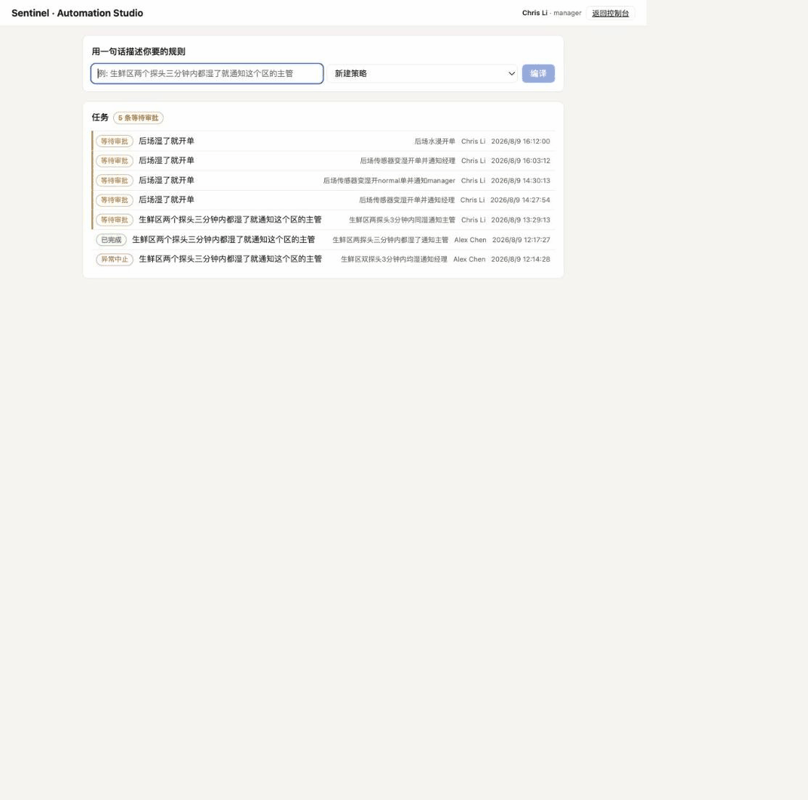
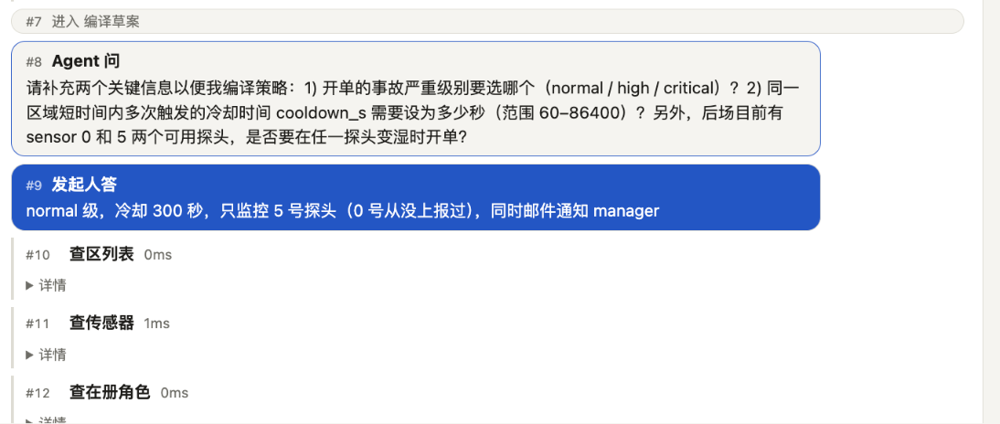
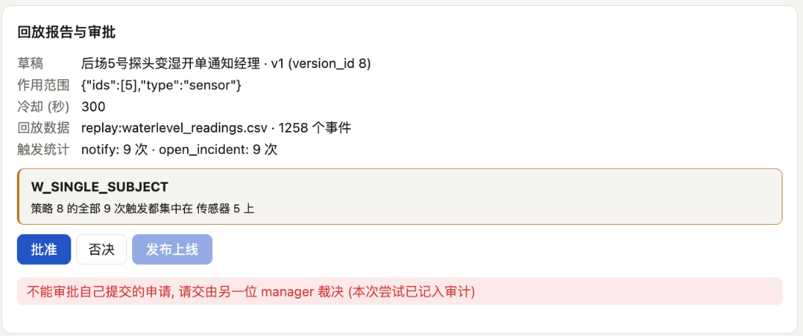
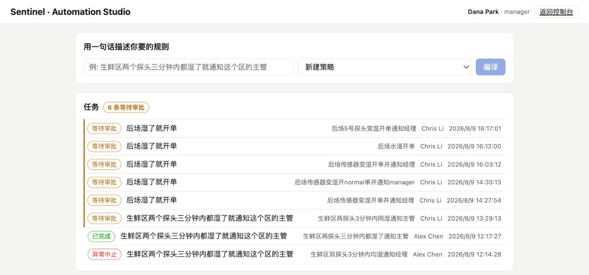

# Sentinel — AI-Native IoT Incident Automation Platform

[](https://github.com/huanggeyu717-beep/sentinel-ops/actions/workflows/ci.yml)

> 将真实部署过的 AWS IoT 漏水监控系统重构为 AI 原生事故自动化平台:
> 确定性引擎负责检测与响应执行; AI 负责把自然语言运营规则编译为
> **经验证、可模拟、需审批**的响应策略, 并为已解决事故生成可审计报告。

## 它做什么

管理员说一句人话, Agent 把它编译成一条受限 DSL 写的策略 —— 中间每一步都摆在界面上,
最后由**另一个人**审批发布。



上面这段是实际录屏, 没有加速。左边输入"后场湿了就开单", 右边的时间线一条条往下长:
查区、查传感器、查在册角色、写草稿、跑回放、提审批 —— **每一步调了什么工具、花了多少毫秒、
拿回来什么, 都能点开看**。事后出了偏差, 不用猜模型哪一步想歪了, 翻到那一行看就是。

**它不猜。**



"后场湿了就开单"这一句里至少有三件事没说: 事故算 normal 还是 critical、同一个地方反复
触发要隔多久才再报一次、后场那两个探头是都算还是只算一个。Agent 停在这里问, 并且顺带
告诉人一件它查出来、人未必知道的事: **`sensor 0` 从来没上报过数据**。人回答之后,
**同一条任务从原地接着跑**, 时间线继续往下长 —— 不是推倒重来一轮。

**发布前先量。**



草案不会直接推到人面前让人凭感觉点头。它先在 344 条真实历史读数 (装载成 1258 个事件)
上回放一遍: 会触发几次、都落在哪。上图这条触发 9 次, 而 **9 次全落在 5 号一个探头上** ——
报告自己把这件事标了出来 (`W_SINGLE_SUBJECT`)。规则写窄了, 在数字里看得见。

**而"没有审批就不能发布"不是靠代码自觉。** 发布要往 `policy_publications` 插一行, 那一行的
`approval_id` 是 NOT NULL 外键 —— **没有审批记录, 这一行在物理上插不进去**, 与应用代码
写成什么样无关 ([ADR-007](docs/adr/ADR-007-publish-requires-approval-fk.md))。上图里提交人
想批自己的策略, 被红字挡了回去, 那是应用层给人看的话; 它后面还有数据库的 CHECK 兜着。
同一条任务换第二位 manager 打开, 同一个"批准"按钮就是亮的 —— **拦的不是这个动作, 是这个人**。

**所以总得有另一个人。**



上图是**另一位 manager (Dana) 登录后看到的第一屏** —— 六条等待审批, 发起人一栏全是
Chris。审批这一关要成立, 前提是审批人自己找得到要批的东西, 而不是等别人把链接发过来:
**没走完的排在最前**, 顶上直接写着有几条在等, 每条带着发起人和原话。直达链接
(`/studio?task=N`) 仍然可用, 但它不再是唯一入口。

## Quickstart

```bash
cp .env.example .env
docker compose up --build                    # db + api + web, 自动建表与写入演示基础数据
open http://localhost:8000/docs              # API 文档

# 灌入原系统真实历史读数 (344 条, 幂等, 可重复执行)
docker compose --profile replay up sim-replay
curl localhost:8000/status/sensors | jq

# 实时演示: 循环回放"同区多传感器无人响应升级"场景
docker compose --profile demo up device-sim
```

不想用 Docker 也可以裸跑: 起一个 Postgres, 设置 `SENTINEL_DATABASE_URL`, 然后
`uvicorn app.main:app --reload` (在 `apps/api` 下) + `python sim.py ...`。
建表由 API 启动时的 Alembic 迁移完成 (W2 起, 见 [ADR-006](docs/adr/ADR-006-alembic-migrations.md)),
裸跑 / CI / Docker 三条路径共用同一份迁移。

### 演示账号 (种子自动写入)

| 邮箱 | 密码 | 角色 |
|---|---|---|
| `admin@example.com` | `sentinel-demo` | admin (不绑现场员工) |
| `chris@example.com` | `sentinel-demo` | manager (绑员工 Chris Li) |
| `alex@example.com` | `sentinel-demo` | operator (绑员工 Alex Chen) |
| `dana@example.com` | `sentinel-demo` | manager (第二位 —— manager 自己写的策略必须由另一位批) |
| `viewer@example.com` | `sentinel-demo` | viewer (只读) |

`POST /auth/login` 登录后会话放在 httpOnly cookie 里, 浏览器里的 `/docs` 直接可用;
curl 场景可从登录响应的 `Set-Cookie` 取 token, 以 `Authorization: Bearer` 请求头携带。
员工 Bo Wang 刻意没有账号: 他只在现场刷卡, 从不登录 (见 SPEC-004)。

## 当前进度

| 周 | 内容 | 状态 |
|---|---|---|
| W1 | 骨架 / Compose / CI / 迁移 / **device-sim** / `/ingest` / `/status` | 完成, 见 [SPEC-000](docs/specs/SPEC-000-w1-ingest.md) |
| W2 | 事故生命周期 + RFID 接单 + JWT/RBAC + React Dashboard | 完成, 见 [SPEC-003](docs/specs/SPEC-003-incident-lifecycle.md) / [SPEC-004](docs/specs/SPEC-004-auth-rbac.md) / [SPEC-005](docs/specs/SPEC-005-dashboard.md) |
| W3 | Policy DSL + 双层验证器 + 引擎/模拟器 + 版本化审批发布 | 完成, 见 [SPEC-001](docs/specs/SPEC-001-policy-dsl.md) / [SPEC-006](docs/specs/SPEC-006-policy-lifecycle.md) |
| W4 | Agent 编排 + Automation Studio + 真实模型接入 | 完成, 见 [SPEC-002](docs/specs/SPEC-002-agent-orchestration.md) |
| W5 | 100 条评测集 + 消融实验 + Evals 面板 + 事故报告 | 未开始 |
| W6 | OTel + 可靠性 + MCP server + 免费托管上线 + 文档 | 未开始 |

## 为什么需要 Agent (而不是表单或聊天框)

跨传感器时间窗 + RFID 接单超时 + 通知/执行器联动的规则空间, 表单会组合爆炸;
但策略必须可靠, 所以 Agent 只负责理解与编译, 确定性引擎负责验证、模拟与执行,
发布必须人工审批。

**模型的能力边界, 说准一点**: 它只能产出**可撤销、只在系统内部留痕**的东西 ——
一份草稿 (没人看就等于不存在)、一条"请人来看一眼"的审批请求 (人可以不理它)。
**不可撤销、外部世界看得见的动作** —— 发布上线、真的发邮件、真的点亮现场的灯 ——
一律在它的能力之外; 其中发布**由数据库外键强制**, 不靠代码自觉。

(这句话的早期版本是"模型没有任何副作用执行权限"。按字面读它站不住 ——
Agent 写草稿、提审批本来就要写库。改成上面这版之后, 它从一句需要别人相信的**承诺**,
变成一句可以当场绕过所有代码去验证的**事实**。)

## 结构

| 路径 | 内容 |
|---|---|
| `apps/api` | FastAPI 模块化单体 (auth/incidents/policies/agent) |
| `apps/web` | React + TS 操作台 (Dashboard / Automation Studio / Tasks / Evals) |
| `apps/device-sim` | 数字孪生模拟器 + 版本化场景包 (原硬件的软件替身) |
| `packages/policy_engine` | Policy DSL + 验证器 + 引擎 (纯函数, 执行=模拟) |
| `evals/` | 100 条评测集 + 确定性 grader + 消融实验 |
| `docs/` | specs / ADR / AWS 映射 / AI 研发证据链 |
| `legacy/` | 原 AWS 系统 (8 Lambda + IaC 备份), 只读证据 |

## 指标 (W5 后由 evals 产出, 不预设)

任务成功率 (A0→A2 消融) / 危险发布拦截率 / P50/P95 / tokens/task / cost/task

W4 已实测、可复现的几个 (配置随数字一起给, 否则复现不了也就核对不了):

| | 值 | 产生它的配置 |
|---|---|---|
| 单轮墙钟 (中位 / 最慢) | 7.2s / 10.0s | `doubao-seed-2-1-pro-260628`, prompt v2, 思考关, 5 次取中位 |
| 历史回放一条策略 | 16 ms | 344 条真实读数 (装载后 1258 事件), 5 次取中位 |
| 深度思考开 / 关 | 83.2s / 1.9s | 同一个 parsing 请求, 两臂对照; 开着直接爆掉 60 秒调用上限 |

**最后一行是 W4 最有用的一个数字**: 它只有接上真实模型才会出现, 打桩阶段永远量不到。
关掉思考是一个取舍不是结论 —— W5 的消融会把它作为一臂正经比一次。

## 数据来源

`apps/device-sim/seed/waterlevel_readings.csv` 是原系统真实运行期间采集的 344 条水位读数,
由队友的分析仓库 [fengzhe-li/iot-sensor-data-analysis](https://github.com/fengzhe-li/iot-sensor-data-analysis)
导出。模拟器以它为基准回放, 因此演示与评测跑的是真实采样节奏与真实数值分布, 而非随机数。
其 2σ 统计阈值检测法将在 W5 作为基线臂参与对比。

## 前身

原系统 (Arduino MKR1010 ×2 + AWS IoT Core/Lambda/RDS/DynamoDB/SES) 曾真实部署运行,
端到端演示视频见 docs/。AWS 环境已按成本考虑注销, 组件映射见 docs/aws-mapping.md。
